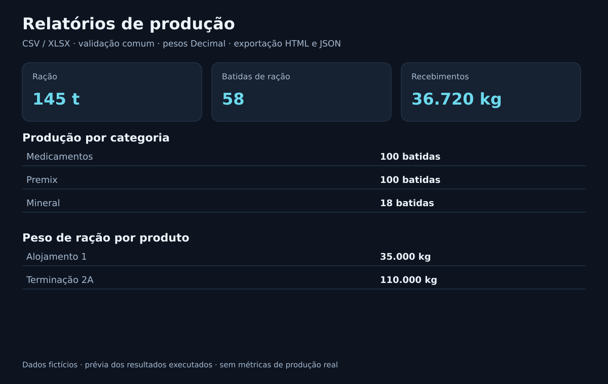

# Relatórios de produção em Python

[](https://github.com/DiogoLazzarotto/relatorios-producao-python/actions/workflows/tests.yml)

Consolida arquivos CSV ou XLSX com validações, filtros de período e totais por produto. Projeto demonstrativo com dados fictícios.

## Prévia dos resultados



Imagem gerada a partir da execução dos dados fictícios; representa os resultados e regras, sem ser uma captura da interface. Reproduza com `python scripts/generate_preview.py`.

## Instalação e execução

Python 3.11+. CSV funciona com a biblioteca padrão. Para ler XLSX ou executar a suíte completa:

```bash
python -m pip install -r requirements-xlsx.txt
python src/report.py examples/producao.csv --start 2026-09-21 --end 2026-09-25 --output output/csv
python src/report.py examples/producao.xlsx --start 2026-09-21 --end 2026-09-25 --output output/xlsx
python -m unittest discover -s tests -v
```

Abra `output/xlsx/relatorio.html` ou [o exemplo gerado](examples/relatorio.html). O navegador permite imprimir/salvar como PDF. `totais.json` fornece a saída estruturada, com kg como string decimal.

Para testar apenas CSV sem instalar pacotes: `python -m unittest discover -s tests -p test_report.py -v`.
Para regenerar a planilha fictícia: `python examples/gerar_xlsx.py`.

## Entrada e regras

Cabeçalho obrigatório, em ordem exata: `data`, `categoria`, `produto`, `batidas`, `kg`.

- CSV: UTF-8 (BOM aceito), separador `;`, datas ISO `AAAA-MM-DD`.
- XLSX: primeira aba na ordem do arquivo, independentemente da aba ativa; cabeçalho na primeira linha. Datas ISO textuais ou células Excel de data sem horário. Horários não zero e números sem formato de data são rejeitados.
- Números: ponto ou vírgula decimal, sem separador de milhares no texto. XLSX também aceita células numéricas. Booleanos, fórmulas e erros Excel são rejeitados.
- Células obrigatórias vazias são inválidas, inclusive kg/batidas: informe zero explicitamente. Linhas XLSX completamente vazias são ignoradas; colunas finais apenas formatadas são ignoradas. Colunas extras com conteúdo são rejeitadas.
- Erros de linha indicam o número físico no arquivo. Cabeçalhos não são corrigidos automaticamente.

Medicamentos, Premix e Mineral usam batidas inteiras e kg=0. Recebimentos usam kg e batidas=0. Ração mostra batidas, kg e total em toneladas. Peso é informado, não inferido por batida. Valores negativos, NaN/infinito, colunas incorretas, produtos vazios e datas inválidas são rejeitados. Duplicatas são somadas: o formato não possui identificador de lançamento.

Toda a entrada é validada antes dos filtros. Em caso de erro, a CLI retorna código 2 e não gera novas saídas; arquivos existentes no destino permanecem como estavam.

## Resultado esperado do exemplo

CSV e XLSX contêm os mesmos nove lançamentos e produzem HTML/JSON idênticos:

- Ração: 145.000 kg / 145 t / 58 batidas.
- Medicamentos: 100 batidas; Premix: 100; Mineral: 18.
- Recebimentos: 36.720 kg.

## Decisões e limites

`Decimal` mantém os pesos na leitura, consolidação e exportação. Células numéricas Excel são convertidas usando `Decimal(str(value))`; isso não recupera dígitos já perdidos na planilha. Para alta precisão, grave kg como texto. O exemplo XLSX usa pesos textuais; os testes também cobrem células numéricas.

HTML escapa título e produtos. XLSX usa `openpyxl==3.1.5` em leitura, sem calcular fórmulas nem usar seus resultados armazenados. CSV continua sem essa dependência. Não lê XLS/XLSM, não seleciona outras abas e não gera PDF diretamente. Não há indicadores reais de produtividade medidos.

[Contrato e decisões XLSX](docs/PROPOSTA_XLSX.md) · [Requisitos](docs/REQUISITOS.md) · [Validação](docs/VALIDACAO.md).

## Obter o projeto

```bash
git clone https://github.com/DiogoLazzarotto/relatorios-producao-python.git
cd relatorios-producao-python
```

[Voltar ao perfil](https://github.com/DiogoLazzarotto)

## Verificação automática

O GitHub Actions executa os testes em Python 3.11 e 3.12 em pushes para `main` e pull requests. Também regenera e compara a prévia com o arquivo versionado.

## Solução de problemas

| Situação | Como corrigir |
|---|---|
| Cabeçalho inválido | Use exatamente `data;categoria;produto;batidas;kg` no CSV. No XLSX, coloque esses cinco nomes na primeira linha, em colunas separadas e na mesma ordem. |
| Data inválida | No CSV, use `2026-10-02`, por exemplo. No XLSX, use texto nesse formato ou uma célula de data sem horário. |
| Célula obrigatória vazia | Preencha todos os campos. Informe `0` em kg ou batidas quando a categoria não usar aquele valor. |
| Número inválido | Remova separadores de milhares, valores negativos e fórmulas. Para um peso de 2.500 kg, informe `2500`. |
| Dados da aba errada | Coloque os lançamentos na primeira aba do XLSX; selecionar outra aba como ativa não altera a leitura. |
| Falta de dependência para XLSX | Execute `python -m pip install -r requirements-xlsx.txt` no mesmo ambiente usado para executar o relatório. |

O peso da ração precisa ser preenchido explicitamente: uma batida de 2.500 kg deve ter `batidas=1` e `kg=2500`. O programa não calcula o peso a partir da quantidade de batidas.

Se a execução falhar, confira a linha indicada na mensagem e execute novamente após corrigir o arquivo. Um relatório antigo pode continuar na pasta de saída; confira o sucesso da nova execução antes de usar os resultados.

Para comparar CSV e XLSX, use os mesmos lançamentos e filtros de período, gere cada formato em uma pasta separada e compare os arquivos `totais.json`.
